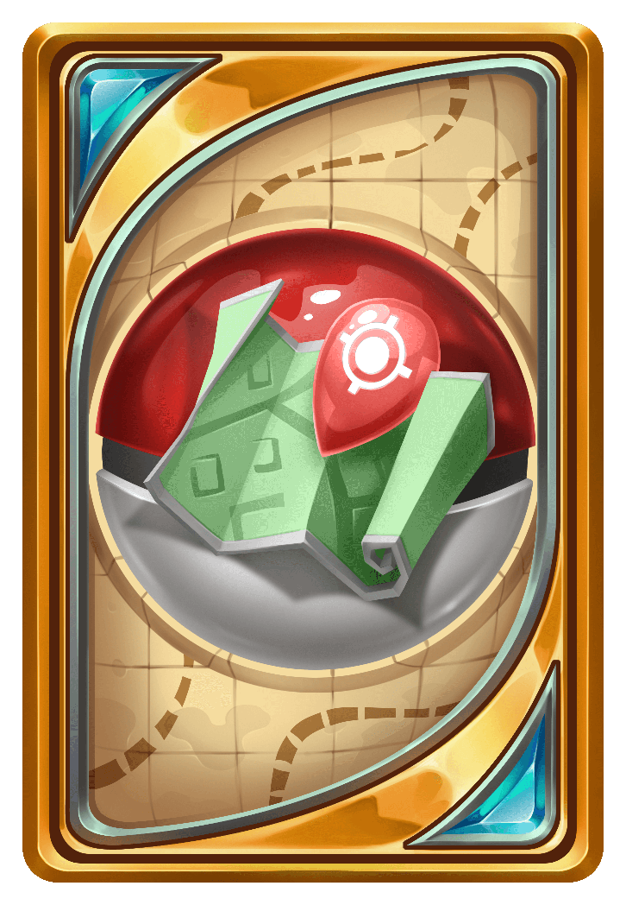

# vote.pokefind.co

The **Java** vote landing page — the original flip-card design, recovered from the
Firebase-hosted site before it was replaced.

Served by GitHub Pages from `main` / root. The `CNAME` file binds it to
`vote.pokefind.co` — **don't delete it**, Pages uses it to hold the custom domain.

## Changing a vote link

Each card is one `div.link` in `index.html`. The URL appears **twice** — once in
`data-url` (used by the JS click handler) and once in the `mobile-link` href
(the fallback for devices where the flip doesn't run). **Change both**, or desktop
and mobile will go to different places:

```html
<div class="link" data-url="https://example.com/vote/123">
    <a class="mobile-link" href="https://example.com/vote/123" target="_blank">
        Example.com
    </a>
    <div class="front"></div>
    <div class="back"></div>
</div>
```

`data-id` picks the card artwork. `assets/js/app.js` swaps `front_N.webp` for
`front_N_G.webp` on hover, so a new card needs all four image variants.

Commit and push — Pages redeploys itself, usually within a minute.

## Changes from the original

- **Card 3** was `minecraft-server.net/vote/Pokefind/`, now `minecraft-mp.com/server/334713/vote/`.
- **`./style.css`** removed — it 404'd on the original; a dead reference.
- **`jquery.flip.min.js` vendored** into `assets/js/`. The original loaded it from
  `cdn.rawgit.com`, a shut-down service that currently redirects to jsDelivr. That
  redirect works today but isn't a guarantee, and if it stops the cards stop flipping.
  jQuery itself still comes from cdnjs, which is healthy and SRI-pinned.

## Keep in sync with the game

The servers do **not** read this page — they hand players the URL from the
`voting_sites` key in the Mongo network config.

The **keys** there are Votifier service names and must match what each site sends on a
vote: `VoteManager` rejects votes from unlisted services, and the "voted on all sites"
bonus requires one vote per key. Changing a key breaks both. Only change values, or
add/remove entries deliberately — and note `ServerAddress.VOTING_SITES` is read once at
class-load, so config changes need a **full server restart**; `/updateconfig` won't do it.

> Card 3 now points at minecraft-mp.com while the config key is still
> `Minecraft-Server.net`. Worth checking the votifier logs for
> `Received vote from invalid service:` — if that's firing, the key is stale and the
> all-sites bonus can never complete.

## Bedrock

Separate page and a slightly different card 5 — see the `votebedrock-site` repo.
